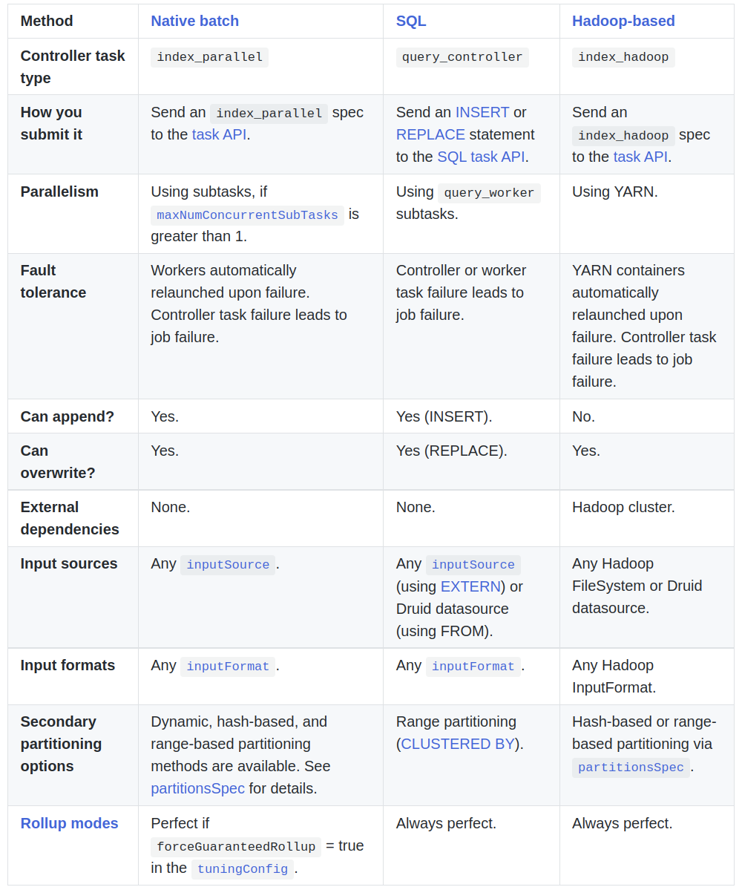

# Druid
## Ingestion


### index_parallel
indexing task를 병렬로 실행한다.
- input source가 splittable 해야 함: [Splittable input sources](https://druid.apache.org/docs/latest/ingestion/native-batch.html#splittable-input-sources)
- `tuningConfig`에서 `maxNumConcurrentSubTasks`: 1보다 커야 병렬로 처리되며, subprocess를 포크하여 실행한다. 각 task는 input file을 읽어 segments에 저장한다.  전체 task는 supervisor task를 포함하여 maxNumConcurrentSubTasks + 1 이다. 실제 task slots( 전체 worker의 가용성 ) 갯수에 상관없이 설정한 갯수만큼 subprocess가 생성된다. `maxNumConcurrentSubTasks=4`로 설정하면 전체 생성되는 task는 5개이나, 하나는 supervisor task이고 worker task는 하나만 돌아간다.  
    
- `segmentGranularity`을 DAY로 설정하여 일자별로 저장  
    ```
    bash-5.1$ ls /opt/shared/segments/data_0_0_0/ -1 
    2022-03-04T00:00:00.000Z_2022-03-05T00:00:00.000Z
    2022-03-08T00:00:00.000Z_2022-03-09T00:00:00.000Z
    2022-03-11T00:00:00.000Z_2022-03-12T00:00:00.000Z
    ...
    ```
- `partitionsSpec` : druid에서 primary partition은 time이다. secondary partitioning을 정할 수 있다.
    - `hashed` : 여러 dimensions의 각 rows 해쉬값
    - `single_dim` : 단일 dimension의 값 범위
    - `range` : 여러 dimensions의 값 범위
    - `dynamic` : 다른 모드는 perfect rollup이나, best-effort rollup을 지원한다. ingestion 속도가 가장 빠르다. 

## Rollup
pre-aggregation으로 미리 데이터를 집계하는 형태이다.
- perfect rollup : ingestion할 때 집계
- best-effort rollup : 완벽한 집계를 하지 않아 여러 segments에서 같은 timestamp, dimension 값을 가질 수 있다