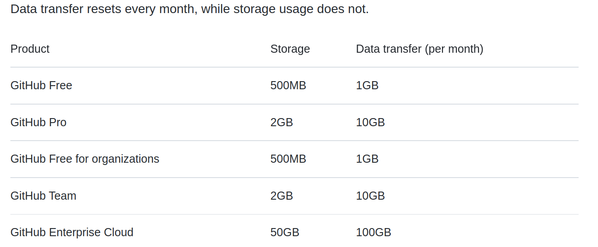

# [INFO] Pulumi project 및 stack 관리
각 stack은 서로 다른 환경을 구성하며 보통 staging/develop/production으로 사용할 수 있다.

monolithic 구조는 하나의 프로젝트에서 infrastructure와 application을 관리한다.
- 단순함
- 코드 버전 관리가 쉽다
- 빠르다

micro-stack 구조는 여러 개의 project로 나누어 관리한다. project와 stack 측면에서 micro-service 구조라고 보면 된다. 각각의 repo를 사용하는 것이 유용하다.
- 독립적
- 보안 : 프로젝트마다 개별적으로 접근 권한을 관리할 필요가 있는 경우
- 프로젝트가 복잡해지면 나눠서 배포하는 것이 성능이 높을 수 있다
각각의 micro-service마다 프로젝트가 있어 독립적으로 배포된다.

Stack에 tagging을 추가하여 환경을 설정할 수 있다.

### with Git repo
- 각 stack은 branch와 바인딩되어 사용한다.
- infrastructure와 application project를 나누어 독립적으로 관리하는 것이 좋다.  
	아래는 monorepo에서 작업할 경우에 대한 예시이다.
	```go
	├── infrastructure
	│   ├── main.go
	│   ├── Pulumi.yaml
	│   ├── Pulumi.dev.yaml
	│   ├── Pulumi.staging.yaml
	│   └── Pulumi.prod.yaml
	├── myApp
	│   ├── main.go
	│   ├── Pulumi.yaml
	│   ├── Pulumi.dev.yaml
	│   ├── Pulumi.staging.yaml
	│   └── Pulumi.prod.yaml
	└── ...
	```


> [Organizing Projects and Stacks](https://www.pulumi.com/docs/guides/organizing-projects-stacks/)

# [INFO] github container registry 
> https://docs.github.com/en/packages/working-with-a-github-packages-registry/working-with-the-container-registry#about-the-container-registry

# [INFO] github container registry vs. docker hub
>> GitHub Container Registry provides an unlimited number of private repositories is also an advantage. On Docker Hub, you are limited to one private repository under the free plan.
>> GitHub Container Registry provides more generous image storage and download terms under its free plan; there are no limits on how often a container image can be downloaded, for instance
## Biling



