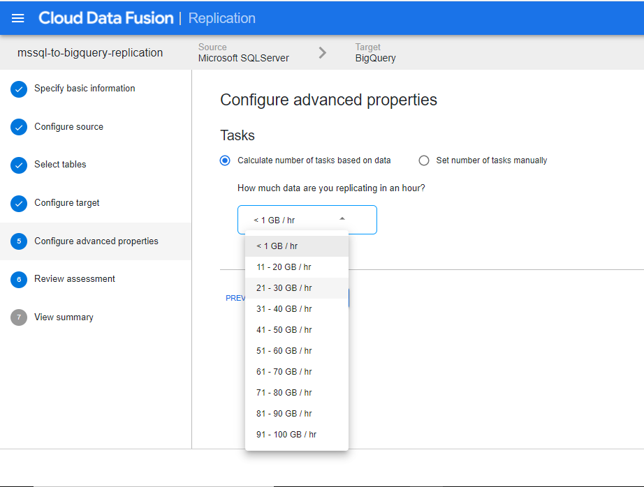

# Untitled

## Data Fusion

> Cloud Data Fusion is a fully managed service created by Google on the Google Cloud that supports data integration of multiple sources at any scale. It enables code-free deployment of ETL and ELT pipelines in a visual point and click environment, **while the execution happens automatically in a Cloud Dataproc environment**. No code is required to blend environments from multiple cloud sources and on-premises databases, either batch or streaming sources. Furthermore, the pipeline created can be easily validated, shared and reused across various teams in your organization.  
Data fusion is built on [CDAP](https://cdap.io/), an open-source framework for building data analytics applications that combine a user interface with a back-end stack of services in a Hadoop cluster.

[Introduction to Cloud Data Fusion](https://datadice.medium.com/introduction-to-cloud-data-fusion-1e2a3c2bf5ca)

### CDAP
Cask Data Application Platform (CDAP)
>CDAP는 개발자에게 데이터 및 애플리케이션 추상화를 제공하여 애플리케이션 개발을 단순화 및 가속화하고, 광범위한 실시간 및 일괄 사용 사례를 처리하고, 엔터프라이즈를 만족시키면서 프로덕션에 애플리케이션을 배포할 수 있는 Hadoop 에코시스템을 위한 통합 오픈 소스 애플리케이션 개발 플랫폼입니다.  
CDAP는 응용 프로그램을 만들고 핵심 CDAP 서비스에 액세스하기 위한 개발자 API(응용 프로그래밍 인터페이스)를 제공합니다. CDAP는 HBase, HDFS, YARN, MapReduce, Hive 및 Spark와 같은 기존 Hadoop 인프라에 애플리케이션 및 데이터를 배치하는 다양한 서비스 모음을 정의하고 구현합니다.  
간단한 MapReduce 작업과 완전한 ETL(추출, 변환 및 로드) 파이프라인에서 복잡한 엔터프라이즈 규모의 데이터 집약적 애플리케이션에 이르기까지 다양한 애플리케이션을 실행할 수 있습니다.


[https://github.com/cdapio/cdap](https://github.com/cdapio/cdap)

### Dataproc in Data Fusion Replication

no-of nodes, memory per node와 같은 설정에 따라 **Dataproc** Workers를 생성하게 된다.



**Dataproc** cluster를 생성하고 소스DB에 연결하여 binary log로부터의 CDC를 사용하게 된다.


## Data Fusion vs. Data Flow


[ 추가 ]

- Dataflow를 사용하는 경우 CDC로 서버리스 datastream을 추가한다.
- Data Fusion의 경우 worker를 프로비저닝을 전데로 한다. 자체 대시보드를 제공한다.

### Data Fusion demo

[ Dashboard ] 


[ BigQuery ] 


[ INSERT 발생 ]


### MERGE query 비교

[ Data Fusion ]

```bash
MERGE `datatest.**sec_mthrpc**` as **T**
USING (SELECT A.* 
			  FROM (SELECT * FROM `datatest.**_staging_sec_mthrpc**` WHERE _batch_id = 1649214025623 AND **_sequence_num** > 18) as A
			 LEFT OUTER JOIN
			(SELECT * FROM `datatest.**_staging_sec_mthrpc**` 
			 WHERE _batch_id = 1649214025623 AND **_sequence_num** > 18) as B
			 ON A.`gvkey` = B.`_before_gvkey` AND A._sequence_num < B._sequence_num
       WHERE B.`_before_gvkey` IS NULL) as **D**
ON **T**.`gvkey` = **D**.`_before_gvkey`
WHEN MATCHED AND D._op = "DELETE" THEN
  DELETE
WHEN MATCHED AND D._op IN ("INSERT", "UPDATE") THEN
  UPDATE SET `index` = D.`index`, `gvkey` = D.`gvkey`, `iid` = D.`iid`, `datadate` = D.`datadate`, `csfsm` = D.`csfsm`, `cshtrm` = D.`cshtrm`, `curcdm` = D.`curcdm`, `navm` = D.`navm`, `prccm` = D.`prccm`, `prchm` = D.`prchm`, `prclm` = D.`prclm`, `pacvertofeedpop` = D.`pacvertofeedpop`, `_sequence_num` = D.`_sequence_num`, _is_deleted = null
WHEN NOT MATCHED AND D._op IN ("INSERT", "UPDATE") THEN
  INSERT (`index`, `gvkey`, `iid`, `datadate`, `csfsm`, `cshtrm`, `curcdm`, `navm`, `prccm`, `prchm`, `prclm`, `pacvertofeedpop`, `_sequence_num`) 
VALUES (`index`, `gvkey`, `iid`, `datadate`, `csfsm`, `cshtrm`, `curcdm`, `navm`, `prccm`, `prchm`, `prclm`, `pacvertofeedpop`, `_sequence_num`)
```

[ DataFlow ]

```bash
MERGE `innate-plexus-345505.compustat.**sec_mthrpc**` AS **replica** 
USING (SELECT `index`,`gvkey`,`iid`,`datadate`,`csfsm`,`cshtrm`,`curcdm`,`navm`,`prccm`,`prchm`,`prclm`,`pacvertofeedpop`,`_metadata_timestamp`,`_metadata_read_timestamp`,`_metadata_read_method`,`_metadata_source_type`,`_metadata_deleted`,`_metadata_change_type`,`_metadata_log_file`,`_metadata_log_position` 
				FROM (SELECT `index`,`gvkey`,`iid`,`datadate`,`csfsm`,`cshtrm`,`curcdm`,`navm`,`prccm`,`prchm`,`prclm`,`pacvertofeedpop`,`_metadata_timestamp`,`_metadata_read_timestamp`,`_metadata_read_method`,`_metadata_source_type`,`_metadata_deleted`,`_metadata_change_type`,`_metadata_log_file`,`_metadata_log_position`, 
											ROW_NUMBER() OVER (PARTITION BY gvkey ORDER BY _metadata_timestamp DESC, _metadata_log_file DESC, _metadata_log_position DESC, _metadata_deleted ASC) as row_num 
							FROM `innate-plexus-345505.compustat.**sec_mthrpc_log**` 
							WHERE COALESCE(_PARTITIONTIME, CURRENT_TIMESTAMP()) >= TIMESTAMP(DATE_ADD(CURRENT_DATE(), INTERVAL -2 DAY)) 
							 AND (COALESCE(_PARTITIONTIME, CURRENT_TIMESTAMP()) >= TIMESTAMP(DATE_ADD(CURRENT_DATE(), INTERVAL -1 DAY))    
							  OR (_PARTITIONTIME >= TIMESTAMP(DATE_ADD(CURRENT_DATE(), INTERVAL -2 DAY))        
							 AND _metadata_deleted))) 
				WHERE row_num=1) AS **staging** 
ON **replica**.gvkey = **staging**.gvkey 
WHEN MATCHED AND replica._metadata_timestamp <= staging._metadata_timestamp AND staging._metadata_deleted=True THEN 
	DELETE 
WHEN MATCHED AND replica._metadata_timestamp <= staging._metadata_timestamp THEN 
  UPDATE SET `index` = staging.index, `gvkey` = staging.gvkey, `iid` = staging.iid, `datadate` = staging.datadate, `csfsm` = staging.csfsm, `cshtrm` = staging.cshtrm, `curcdm` = staging.curcdm, `navm` = staging.navm, `prccm` = staging.prccm, `prchm` = staging.prchm, `prclm` = staging.prclm, `pacvertofeedpop` = staging.pacvertofeedpop, `_metadata_timestamp` = staging._metadata_timestamp, `_metadata_read_timestamp` = staging._metadata_read_timestamp, `_metadata_read_method` = staging._metadata_read_method, `_metadata_source_type` = staging._metadata_source_type, `_metadata_deleted` = staging._metadata_deleted, `_metadata_change_type` = staging._metadata_change_type, `_metadata_log_file` = staging._metadata_log_file, `_metadata_log_position` = staging._metadata_log_position 
WHEN NOT MATCHED BY TARGET AND staging._metadata_deleted!=True THEN 
	INSERT(`index`,`gvkey`,`iid`,`datadate`,`csfsm`,`cshtrm`,`curcdm`,`navm`,`prccm`,`prchm`,`prclm`,`pacvertofeedpop`,`_metadata_timestamp`,`_metadata_read_timestamp`,`_metadata_read_method`,`_metadata_source_type`,`_metadata_deleted`,`_metadata_change_type`,`_metadata_log_file`,`_metadata_log_position`) 
VALUES (staging.index, staging.gvkey, staging.iid, staging.datadate, staging.csfsm, staging.cshtrm, staging.curcdm, staging.navm, staging.prccm, staging.prchm, staging.prclm, staging.pacvertofeedpop, staging._metadata_timestamp, staging._metadata_read_timestamp, staging._metadata_read_method, staging._metadata_source_type, staging._metadata_deleted, staging._metadata_change_type, staging._metadata_log_file, staging._metadata_log_position)
```

- Data Fusion에서는 `_sequence_num` 칼럼을 기준으로 비교하여 데이터를 업데이트한다.
- Data Flow에서는 primary key, log 메타 데이터를 기반으로 고유 row값을 계산한 `row_num` 칼럼을 기준으로 데이터를 업데이트한다.( Data Fusion의 `_sequence_num` 과 동일한 역할을 수행하는 것으로 보임 )
- Data Flow `MERGE` 쿼리가 보다 복잡하여 시간이 좀 더 소요되는 것으로 보인다.
- Data Fusion에서 사용한 임시 _staging 테이블은 MERGE 완료 후 사라지지만 Data Flow에서 사용한 임시 log테이블은 잔류한다.

## Setting MySQL parameter: lower_case_table_names, character_set*, collation*

- Cloud SQL MySQL에서는 8.0 버전 이상인 경우 `lower_case_table_names=1` 이 지원되지 않는다.
- AWS RDS MySQL에서는 지원되나 인스턴스 생성시 파라미터 그룹을 변경하여 반영시켜줘야 한다.


[Configure database flags | Cloud SQL for MySQL | Google Cloud](https://cloud.google.com/sql/docs/mysql/flags)


[Set MySQL server variable collation_connection to utf8_unicode_ci on AWS RDS](https://stackoverflow.com/questions/35931530/set-mysql-server-variable-collation-connection-to-utf8-unicode-ci-on-aws-rds)

### AWS RDS MySQL 파라미터 변경

AWS RDS 파라미터 그룹에서 `collation_connectio=utf8mb4_bin` 으로 설정하였으나 로컬에서 접속해서 확인하니 변경되지 않았음.

```bash
+---------------------------------+------------------------+
| Variable_name                   | Value                  |
+---------------------------------+------------------------+
| collation_connection            | latin1_swedish_ci            |          |                  |
+---------------------------------+------------------------+
```

→ client에서 연결을 생성할 때 설정이 해줘야 된다기에 `init_connect` 에서 초기 설정될 수 있도록 추가하였더니 적용되었다.

```bash
+---------------------------------+------------------------+
| Variable_name                   | Value                  |
+---------------------------------+------------------------+
| collation_connection            | utf8mb4_bin            |
| collation_database              | utf8mb4_bin            |
| collation_server                | utf8mb4_bin            |                  |
+---------------------------------+------------------------+
8 rows in set (0.01 sec)
+---------------+----------------------------------------+
| Variable_name | Value                                  |
+---------------+----------------------------------------+
| init_connect  | set COLLATION_CONNECTION = utf8mb4_bin |
```

- **SET NAMES 설정시**

설정 예시 : SET NAMES 'utf8mb4'

character_set_client

character_set_connection

character_set_results

- **SET collation_connection**

설정 예시 SET collation_connection='utf8mb4_unicode_ci'

collation_connection 이 변경

- **다중 init-connect 사용시**

init-connect=SET NAMES 'utf8mb4'

init-connect=SET collation_connection='utf8mb4_unicode_ci'

[ 추가 ]

> 클라이언트 환경 변수에 지정된 문자셋 대신 character_set_server 사용을 강제 하는 skip-character-set-client-handshake 파라미터가 지정이 되어 있어도 init-connect 에 설정된 값을 따라서 케릭터셋과 collation 은 설정이 변경 됩니다.
> 

[MySQL Character Set 과 utf8mb4](https://hoing.io/archives/13254)

관련 parameter 설명

[Best practices for configuring parameters for Amazon RDS for MySQL, part 3: Parameters related to security, operational manageability, and connectivity timeout | Amazon Web Services](https://aws.amazon.com/ko/blogs/database/best-practices-for-configuring-parameters-for-amazon-rds-for-mysql-part-3-parameters-related-to-security-operational-manageability-and-connectivity-timeout/)