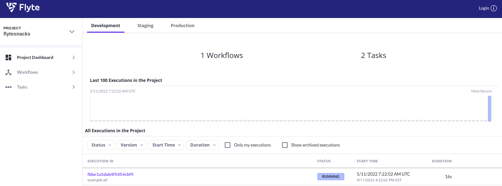

# [Flyte](https://docs.flyte.org/en/latest/index.html)
Flyte is an open-source, container-native, structured programming and distributed processing platform implemented in Golang.

## 실행
### client
```console
$ pyflyte run example.py wf --n 500 --mean 42 --sigma 2
---
DefaultNamedTupleOutput(o0=42.03233910461306, o1=2.04144421035595)
```

### cluster 생성

```console
$ curl -sL https://ctl.flyte.org/install | sudo bash -s -- -b /usr/local/bin
$ export PATH=$(pwd)/bin:$PATH
```
```console
$ flytectl demo start
...
+---------------------------------------------+---------------+-----------+
|                   SERVICE                   |    STATUS     | NAMESPACE |
+---------------------------------------------+---------------+-----------+
| flyte-kubernetes-dashboard-7fd989b99d-6bnn7 | Running       | flyte     |
+---------------------------------------------+---------------+-----------+
| postgres-76c5456bdf-jcwqc                   | Running       | flyte     |
+---------------------------------------------+---------------+-----------+
| minio-699ccf97f9-7pzrf                      | Running       | flyte     |
+---------------------------------------------+---------------+-----------+
Flyte is ready! Flyte UI is available at http://localhost:30080/console
...
```

docker 컨테이너와 k8s 클러스터에서 image애서 받아 default namespace에 pod가 생성됨을 확인할 수 있다.

```console
$ docker ps 

CONTAINER ID   IMAGE                                                                                   COMMAND                  CREATED              STATUS                 PORTS                                                                                                                                                                        NAMES
0f822e335834   cr.flyte.org/flyteorg/flyte-sandbox-lite:sha-5570eff6bd636e07e40b22c79319e46f927519a3   "tini flyte-entrypoi…"   About a minute ago   Up About a minute      0.0.0.0:30080-30082->30080-30082/tcp, 0.0.0.0:30084->30084/tcp, 0.0.0.0:30086->30086/tcp, 2375-2376/tcp, 0.0.0.0:30088-30089->30088-30089/tcp

$ kubectl get pods 
NAME          READY   STATUS      RESTARTS   AGE
py39-cacher   0/1     Completed   0          60s
```

Flyte Cluster에서 실행하려면 `--remote` 옵션을 추가한다.
```console
$ pyflyte run --remote example.py wf --n 500 --mean 42 --sigma 2
Go to http://localhost:30080/console/projects/flytesnacks/domains/development/executions/fbbe1a5dab4f5454cbf9 to see execution in the console.
```
위 URL로 들어가면 아래와 같이 workflow와 task가 생성됨을 확인할 수 있다.



- `@workflow`로 wrapping된 function은 Workflows에 존재한다.


- `@task`로 wrapping된 function은 Tasks에 존재한다.


## 특징
[User Guide](https://docs.flyte.org/projects/cookbook/en/latest/index.html)

- Flyte는 data-aware DAG 스케줄링 프로그램이다.
- Flyte는 Docker Container 기반에서 배포된다.
- Flyte에서 workflow 실행은 Kubernetes 리소스로 생성된다.

### Keyword
- Tasks : `@task`
    - caching : `@task(cache=True, cache_version="1.0")` 
    - `ShellTask` : run bash scripts
    - `reference_task` : 이미 정의되어 등록되어 있는 Flyte task
- Workflow : `@workflow` 
- Named Output : output에 명명하여 저장 ex. `wf_outputs = typing.NamedTuple("OP2", greet1=str, greet2=str)`
- Type System : schema를 적용할 수 있고 `StructuredDataset`을 통해 BigQuery나 S3에 dataframe을 write 가능하다.
- Containerization : 격리된 컨테이너에서 Task를 실행할 수 있다. 
    - `ContainerTask`
    - `@task(container_image="...")`로 image를 변경하여 여러 container image를 적용 가능하다.
    - Secret 사용 : ex. `@task(secret_requests=[Secret(group=SECRET_GROUP, key=SECRET_NAME)])`
        
    - workflow labels / annotations
- Scheduling workflows : Scheduler를 통해 Launch Plan을 자동으로 실행시킬 수 있다. `CronSchedule`

### Production Config

로컬에서는 Python interpreter에 의존하기 때문에 배포된 Flyte backend를 사용하는 것으로 권장한다.

Workflow 는 아래와 같이 배포한다.
1. Build Dockerfile
```Dockerfile
FROM python:3.8-slim-buster
LABEL org.opencontainers.image.source https://github.com/flyteorg/flytesnacks
...
```
2. Serialize worflows and tasks  
- `make serialize`
- `pyflyte -c sandbox.config --pkgs core serialize --in-container-config-path /root/sandbox.config --local-source-root ${CURDIR} --image ${FULL_IMAGE_NAME}:${VERSION} workflows -f _pb_output/`
 
3. Register workflows and tasks  
- `flytectl register files _pb_output/* -p flytetester -d development --version ${VERSION} --k8sServiceAccount demo --outputLocationPrefix s3://my-s3-bucket/raw_data`

호스팅된 Flyte 환경을 사용하면 리소스( `cpu`, `mem`, `gpu`)를 할당할 수 있는 이점이 있다.  
ex. `@task(requests=Resources(cpu="1", mem="100Mi"), limits=Resources(cpu="2", mem="150Mi"))`