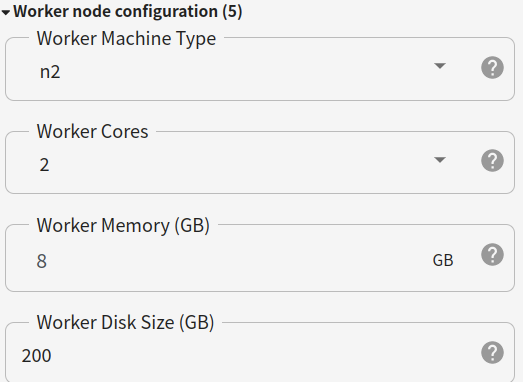

# Data Fusion


> Cloud Data Fusion is a fully managed service created by Google on the Google Cloud that supports data integration of multiple sources at any scale. It enables code-free deployment of ETL and ELT pipelines in a visual point and click environment, **while the execution happens automatically in a Cloud Dataproc environment**. No code is required to blend environments from multiple cloud sources and on-premises databases, either batch or streaming sources. Furthermore, the pipeline created can be easily validated, shared and reused across various teams in your organization.  
Data fusion is built on [CDAP](https://cdap.io/), an open-source framework for building data analytics applications that combine a user interface with a back-end stack of services in a Hadoop cluster.

[Introduction to Cloud Data Fusion](https://datadice.medium.com/introduction-to-cloud-data-fusion-1e2a3c2bf5ca)

### CDAP
Cask Data Application Platform (CDAP)
>CDAP는 개발자에게 데이터 및 애플리케이션 추상화를 제공하여 애플리케이션 개발을 단순화 및 가속화하고, 광범위한 실시간 및 일괄 사용 사례를 처리하고, 엔터프라이즈를 만족시키면서 프로덕션에 애플리케이션을 배포할 수 있는 Hadoop 에코시스템을 위한 통합 오픈 소스 애플리케이션 개발 플랫폼입니다.  
CDAP는 응용 프로그램을 만들고 핵심 CDAP 서비스에 액세스하기 위한 개발자 API(응용 프로그래밍 인터페이스)를 제공합니다. CDAP는 HBase, HDFS, YARN, MapReduce, Hive 및 Spark와 같은 기존 Hadoop 인프라에 애플리케이션 및 데이터를 배치하는 다양한 서비스 모음을 정의하고 구현합니다.  
간단한 MapReduce 작업과 완전한 ETL(추출, 변환 및 로드) 파이프라인에서 복잡한 엔터프라이즈 규모의 데이터 집약적 애플리케이션에 이르기까지 다양한 애플리케이션을 실행할 수 있습니다.


[https://github.com/cdapio/cdap](https://github.com/cdapio/cdap)

### Dataproc in Data Fusion Replication

no-of nodes, memory per node와 같은 설정에 따라 **Dataproc** Workers를 생성하게 된다.


**Dataproc** cluster를 생성하고 소스DB에 연결하여 binary log로부터의 CDC를 사용하게 된다.


- Data Fusion 하나의 인스턴스 내에서 한 개의 job을 기준으로 하나의 클러스터가 생성
- Worker node가 없는 단일 노드 클러스터에서는 실행이 되지 않는 것 같음
- 크기가 1 ~ 10GB인 테이블 11개인 경우 20분동안 active table이 하나였는데 크기가 1GB이하인 테이블 99개의 경우 20분 동안 3개의 active table이 발생( 사이즈가 작아서 그런지 전체 행 복제 완료한 것으로 보임 ) : throughput 은 1GB/hr였음

→  테이블의 갯수보다 **크기에 따라** task의 진척도에 차이가 있는 것 같다.( replicate하려는 테이블 갯수가 더 많은데도 같은 throughput에서 활성화되는데 더 빠름 )

## Bugs

아래와 같은 오류가 발생( storage bucket을 찾을 수 없다고 함 )

```bash
2022-04-07 03:29:03,635 - WARN  [runtime-scheduler-16:i.c.c.r.s.c.DataprocUtils@94] - GCS path cdap-job/733b927a-b622-11ec-a39d-aea9e7c408fb was not cleaned up for bucket df-2356261784124773891-b6chvo5u3mi6zdcvhqug2nlzci due to The specified bucket does not exist.. 
com.google.cloud.storage.StorageException: The specified bucket does not exist.
****	at com.google.cloud.storage.spi.v1.HttpStorageRpc.translate(HttpStorageRpc.java:229) ~[com.google.cloud.google-cloud-storage-1.101.0.jar:1.101.0]
	at com.google.cloud.storage.spi.v1.HttpStorageRpc.list(HttpStorageRpc.java:370) ~[com.google.cloud.google-cloud-storage-1.101.0.jar:1.101.0]
	at com.google.cloud.storage.StorageImpl$8.call(StorageImpl.java:376) ~[com.google.cloud.google-cloud-storage-1.101.0.jar:1.101.0]
	at com.google.cloud.storage.StorageImpl$8.call(StorageImpl.java:373) ~[com.google.cloud.google-cloud-storage-1.101.0.jar:1.101.0]
	at com.google.api.gax.retrying.DirectRetryingExecutor.submit(DirectRetryingExecutor.java:105) ~[com.google.api.gax-1.51.0.jar:1.51.0]
	at com.google.cloud.RetryHelper.run(RetryHelper.java:76) ~[com.google.cloud.google-cloud-core-1.91.3.jar:1.91.3]
	at com.google.cloud.RetryHelper.runWithRetries(RetryHelper.java:50) ~[com.google.cloud.google-cloud-core-1.91.3.jar:1.91.3]
	at com.google.cloud.storage.StorageImpl.listBlobs(StorageImpl.java:372) ~[com.google.cloud.google-cloud-storage-1.101.0.jar:1.101.0]
	at com.google.cloud.storage.StorageImpl.list(StorageImpl.java:328) ~[com.google.cloud.google-cloud-storage-1.101.0.jar:1.101.0]
	at io.cdap.cdap.runtime.spi.common.DataprocUtils.deleteGCSPath(DataprocUtils.java:81) ~[io.cdap.cdap.cdap-runtime-ext-dataproc-6.6.0.jar:na]
	at io.cdap.cdap.runtime.spi.runtimejob.DataprocRuntimeJobManager.launch(DataprocRuntimeJobManager.java:214) [io.cdap.cdap.cdap-runtime-ext-dataproc-6.6.0.jar:na]
	at io.cdap.cdap.internal.app.runtime.distributed.remote.RuntimeJobTwillPreparer.launch(RuntimeJobTwillPreparer.java:90) [na:na]
	at io.cdap.cdap.internal.app.runtime.distributed.remote.AbstractRuntimeTwillPreparer.lambda$start$1(AbstractRuntimeTwillPreparer.java:466) [na:na]
	at io.cdap.cdap.internal.app.runtime.distributed.remote.RemoteExecutionTwillRunnerService$ControllerFactory.lambda$create$0(RemoteExecutionTwillRunnerService.java:554) ~[na:na]
	at java.util.concurrent.Executors$RunnableAdapter.call(Executors.java:511) ~[na:1.8.0_322]
	at java.util.concurrent.FutureTask.run(FutureTask.java:266) ~[na:1.8.0_322]
	at java.util.concurrent.ScheduledThreadPoolExecutor$ScheduledFutureTask.access$201(ScheduledThreadPoolExecutor.java:180) ~[na:1.8.0_322]
	at java.util.concurrent.ScheduledThreadPoolExecutor$ScheduledFutureTask.run(ScheduledThreadPoolExecutor.java:293) ~[na:1.8.0_322]
	at java.util.concurrent.ThreadPoolExecutor.runWorker(ThreadPoolExecutor.java:1149) ~[na:1.8.0_322]
	at java.util.concurrent.ThreadPoolExecutor$Worker.run(ThreadPoolExecutor.java:624) ~[na:1.8.0_322]
	at java.lang.Thread.run(Thread.java:750) ~[na:1.8.0_322]
Caused by: com.google.api.client.googleapis.json.GoogleJsonResponseException: 404 Not Found
{
  "code" : 404,
  "errors" : [ {
    "domain" : "global",
    "message" : "The specified bucket does not exist.",
    "reason" : "notFound"
  } ],
  "message" : "The specified bucket does not exist."
}
	at com.google.api.client.googleapis.json.GoogleJsonResponseException.from(GoogleJsonResponseException.java:150) ~[com.google.api-client.google-api-client-1.25.0.jar:1.25.0]
	at com.google.api.client.googleapis.services.json.AbstractGoogleJsonClientRequest.newExceptionOnError(AbstractGoogleJsonClientRequest.java:113) ~[com.google.api-client.google-api-client-1.25.0.jar:1.25.0]
	at com.google.api.client.googleapis.services.json.AbstractGoogleJsonClientRequest.newExceptionOnError(AbstractGoogleJsonClientRequest.java:40) ~[com.google.api-client.google-api-client-1.25.0.jar:1.25.0]
	at com.google.api.client.googleapis.services.AbstractGoogleClientRequest$1.interceptResponse(AbstractGoogleClientRequest.java:321) ~[com.google.api-client.google-api-client-1.25.0.jar:1.25.0]
	at com.google.api.client.http.HttpRequest.execute(HttpRequest.java:1092) ~[com.google.http-client.google-http-client-1.33.0.jar:1.33.0]
	at com.google.api.client.googleapis.services.AbstractGoogleClientRequest.executeUnparsed(AbstractGoogleClientRequest.java:419) ~[com.google.api-client.google-api-client-1.25.0.jar:1.25.0]
	at com.google.api.client.googleapis.services.AbstractGoogleClientRequest.executeUnparsed(AbstractGoogleClientRequest.java:352) ~[com.google.api-client.google-api-client-1.25.0.jar:1.25.0]
	at com.google.api.client.googleapis.services.AbstractGoogleClientRequest.execute(AbstractGoogleClientRequest.java:469) ~[com.google.api-client.google-api-client-1.25.0.jar:1.25.0]
	at com.google.cloud.storage.spi.v1.HttpStorageRpc.list(HttpStorageRpc.java:360) ~[com.google.cloud.google-cloud-storage-1.101.0.jar:1.101.0]
	... 19 common frames omitted
```

Data Fusion Start logging

[default-xf-replication-workers-DeltaWorker-0192c657-b683-11ec-b253-eaa8cd9145e1.log](img2/default-xf-replication-workers-DeltaWorker-0192c657-b683-11ec-b253-eaa8cd9145e1.log)

→ Data Fusion 인스턴스를 삭제하고 재생성하니 해결됨. 이전에 임의로 버킷을 삭제하였는데 인스턴스 내에서 사용하던 스토리지가 필요했던 것 같음.

아래의 오류는 데이터를 로드할 수 없다는 내용인데 BigQuery에서 받아들일 수 없는 문자( 해시값 같은 )가 포함되어 있었던 것 같음

```bash
Failed to load a batch of changes from GCS into staging table
```

[Google Cloud Data Fusion MySQL replication job Failed to merge a batch of changes from the staging table](https://stackoverflow.com/questions/66640349/google-cloud-data-fusion-mysql-replication-job-failed-to-merge-a-batch-of-change)

아래의 경우는 노드가 없다는 오류로 파악됨

```bash
2022-04-08 04:00:27,696 - INFO [zk-client-EventThread:o.a.t.y.YarnTwillController@236] - Failed to access application worker.default.computat-main-replication.DeltaWorker application_1649390038493_0001 live node in ZK, resort to polling. 
Failure reason: KeeperErrorCode = NoNode for /instances/567333d2-2ad3-4965-84e9-447060393149
```

## Resource Setup

### **Cluster 생성**

- Auto Scaling을 허용하는 클러스터를 구성( 아래는 Worker Node )



- master node 1 , worker node 2로 구성된 하나의 클러스터가 생성됨을 확인( 3개의 인스턴스가 활성화됨 )


Replication Job을 중단하면 클러스터도 함께 지워짐


### Setup Comparison

throughput은 1GB이하 /hr, 1 master + 2 worker 클러스터로 설정하였다.

2개의 Job으로 구분하여 99개의 테이블 복제( 1GB 이하 ), 11개의 테이블 복제( 1 ~ 9GB )하는 경우를 비교한다.

- 기본적으로 하나의 인스턴스 내에서 한 개의 job을 기준으로 하나의 클러스터가 생성된다.
- 다른 리소스 현상은 비슷한데 테이블 크기가 큰 11개의 테이블 로드로 구성된 task가 CPU를 많이 사용하였다.


- Worker node가 없는 단일 노드 클러스터에서는 실행이 되지 않는 것으로 확인됨: 단일 노드 클러스터( 4CPU, 8GB )에서 20분 가량 처리가 없었는데 2개의 Worker node로 구성한 클러스터로 돌리니 약 7분만에 active table이 발생하였다.
- 크기가 1 ~ 10GB인 테이블 11개인 경우 20분동안 active table이 하나였는데 크기가 1GB이하인 테이블 99개의 경우 20분 동안 3개의 active table이 생겼다.

replicate하려는 테이블 갯수가 더 많은데도 같은 throughput에서 활성화되는데 더 빠른 것으로 보아 **테이블의 갯수보다 크기에 따라 task의 진척도에 차이가 있는 것 같다.**

throughput을 늘렸더니 ( 당연하겠지만 ) 더 빨라짐을 확인하였다.

[ throughput이 1GB 이하 /hr ]


[ throughput이 1GB ~ 10GB/hr ]


+추가적으로 시간이 지나면서 활성화된 테이블은 복제되는 데이터 양이 점점 늘어남을 알 수 있다.

