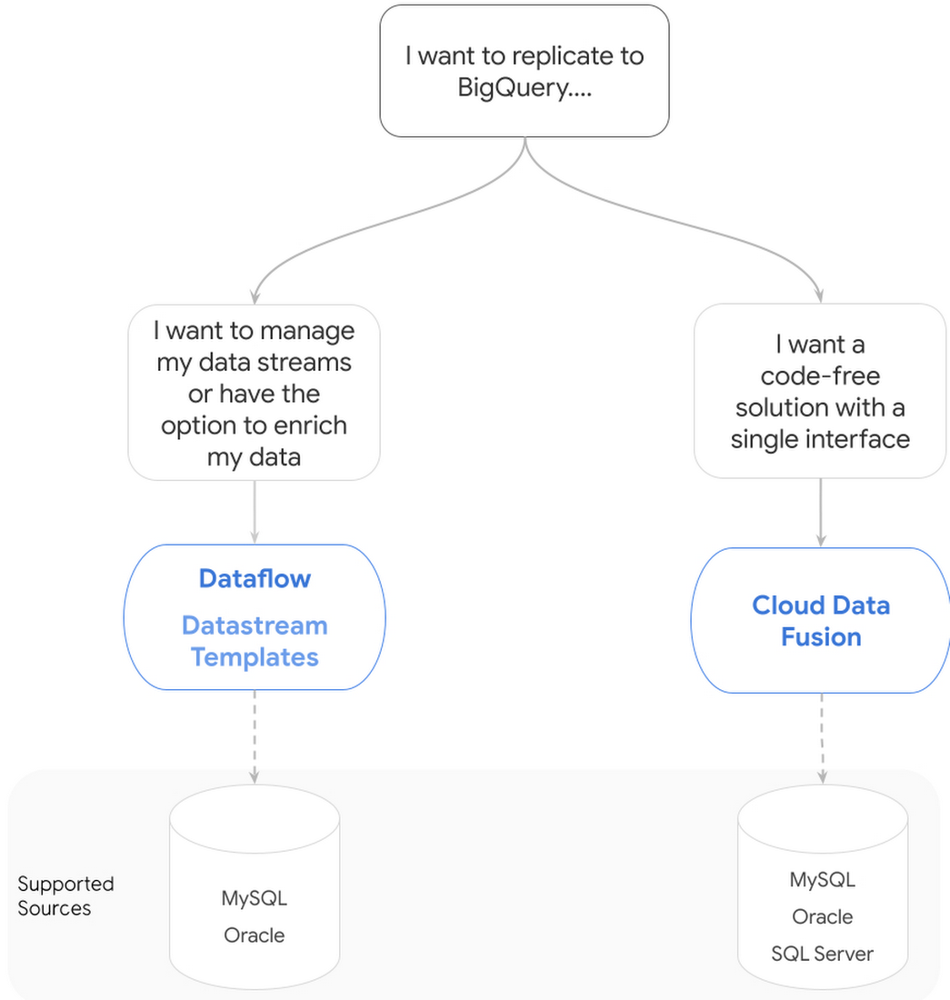

## Data Fusion vs. Data Flow




[ 추가 ]

- Dataflow를 사용하는 경우 CDC로 서버리스 datastream을 추가한다.
- Data Fusion의 경우 worker를 프로비저닝을 전데로 한다. 자체 대시보드를 제공한다.

### Data Fusion demo

[ Dashboard ] 


[ BigQuery ] 


[ INSERT 발생 ]


### MERGE query 비교

[ Data Fusion ]

```bash
MERGE `datatest.**sec_mthrpc**` as **T**
USING (SELECT A.* 
			  FROM (SELECT * FROM `datatest.**_staging_sec_mthrpc**` WHERE _batch_id = 1649214025623 AND **_sequence_num** > 18) as A
			 LEFT OUTER JOIN
			(SELECT * FROM `datatest.**_staging_sec_mthrpc**` 
			 WHERE _batch_id = 1649214025623 AND **_sequence_num** > 18) as B
			 ON A.`gvkey` = B.`_before_gvkey` AND A._sequence_num < B._sequence_num
       WHERE B.`_before_gvkey` IS NULL) as **D**
ON **T**.`gvkey` = **D**.`_before_gvkey`
WHEN MATCHED AND D._op = "DELETE" THEN
  DELETE
WHEN MATCHED AND D._op IN ("INSERT", "UPDATE") THEN
  UPDATE SET `index` = D.`index`, `gvkey` = D.`gvkey`, `iid` = D.`iid`, `datadate` = D.`datadate`, `csfsm` = D.`csfsm`, `cshtrm` = D.`cshtrm`, `curcdm` = D.`curcdm`, `navm` = D.`navm`, `prccm` = D.`prccm`, `prchm` = D.`prchm`, `prclm` = D.`prclm`, `pacvertofeedpop` = D.`pacvertofeedpop`, `_sequence_num` = D.`_sequence_num`, _is_deleted = null
WHEN NOT MATCHED AND D._op IN ("INSERT", "UPDATE") THEN
  INSERT (`index`, `gvkey`, `iid`, `datadate`, `csfsm`, `cshtrm`, `curcdm`, `navm`, `prccm`, `prchm`, `prclm`, `pacvertofeedpop`, `_sequence_num`) 
VALUES (`index`, `gvkey`, `iid`, `datadate`, `csfsm`, `cshtrm`, `curcdm`, `navm`, `prccm`, `prchm`, `prclm`, `pacvertofeedpop`, `_sequence_num`)
```

[ DataFlow ]

```bash
MERGE `innate-plexus-345505.compustat.**sec_mthrpc**` AS **replica** 
USING (SELECT `index`,`gvkey`,`iid`,`datadate`,`csfsm`,`cshtrm`,`curcdm`,`navm`,`prccm`,`prchm`,`prclm`,`pacvertofeedpop`,`_metadata_timestamp`,`_metadata_read_timestamp`,`_metadata_read_method`,`_metadata_source_type`,`_metadata_deleted`,`_metadata_change_type`,`_metadata_log_file`,`_metadata_log_position` 
				FROM (SELECT `index`,`gvkey`,`iid`,`datadate`,`csfsm`,`cshtrm`,`curcdm`,`navm`,`prccm`,`prchm`,`prclm`,`pacvertofeedpop`,`_metadata_timestamp`,`_metadata_read_timestamp`,`_metadata_read_method`,`_metadata_source_type`,`_metadata_deleted`,`_metadata_change_type`,`_metadata_log_file`,`_metadata_log_position`, 
											ROW_NUMBER() OVER (PARTITION BY gvkey ORDER BY _metadata_timestamp DESC, _metadata_log_file DESC, _metadata_log_position DESC, _metadata_deleted ASC) as row_num 
							FROM `innate-plexus-345505.compustat.**sec_mthrpc_log**` 
							WHERE COALESCE(_PARTITIONTIME, CURRENT_TIMESTAMP()) >= TIMESTAMP(DATE_ADD(CURRENT_DATE(), INTERVAL -2 DAY)) 
							 AND (COALESCE(_PARTITIONTIME, CURRENT_TIMESTAMP()) >= TIMESTAMP(DATE_ADD(CURRENT_DATE(), INTERVAL -1 DAY))    
							  OR (_PARTITIONTIME >= TIMESTAMP(DATE_ADD(CURRENT_DATE(), INTERVAL -2 DAY))        
							 AND _metadata_deleted))) 
				WHERE row_num=1) AS **staging** 
ON **replica**.gvkey = **staging**.gvkey 
WHEN MATCHED AND replica._metadata_timestamp <= staging._metadata_timestamp AND staging._metadata_deleted=True THEN 
	DELETE 
WHEN MATCHED AND replica._metadata_timestamp <= staging._metadata_timestamp THEN 
  UPDATE SET `index` = staging.index, `gvkey` = staging.gvkey, `iid` = staging.iid, `datadate` = staging.datadate, `csfsm` = staging.csfsm, `cshtrm` = staging.cshtrm, `curcdm` = staging.curcdm, `navm` = staging.navm, `prccm` = staging.prccm, `prchm` = staging.prchm, `prclm` = staging.prclm, `pacvertofeedpop` = staging.pacvertofeedpop, `_metadata_timestamp` = staging._metadata_timestamp, `_metadata_read_timestamp` = staging._metadata_read_timestamp, `_metadata_read_method` = staging._metadata_read_method, `_metadata_source_type` = staging._metadata_source_type, `_metadata_deleted` = staging._metadata_deleted, `_metadata_change_type` = staging._metadata_change_type, `_metadata_log_file` = staging._metadata_log_file, `_metadata_log_position` = staging._metadata_log_position 
WHEN NOT MATCHED BY TARGET AND staging._metadata_deleted!=True THEN 
	INSERT(`index`,`gvkey`,`iid`,`datadate`,`csfsm`,`cshtrm`,`curcdm`,`navm`,`prccm`,`prchm`,`prclm`,`pacvertofeedpop`,`_metadata_timestamp`,`_metadata_read_timestamp`,`_metadata_read_method`,`_metadata_source_type`,`_metadata_deleted`,`_metadata_change_type`,`_metadata_log_file`,`_metadata_log_position`) 
VALUES (staging.index, staging.gvkey, staging.iid, staging.datadate, staging.csfsm, staging.cshtrm, staging.curcdm, staging.navm, staging.prccm, staging.prchm, staging.prclm, staging.pacvertofeedpop, staging._metadata_timestamp, staging._metadata_read_timestamp, staging._metadata_read_method, staging._metadata_source_type, staging._metadata_deleted, staging._metadata_change_type, staging._metadata_log_file, staging._metadata_log_position)
```

- Data Fusion에서는 `_sequence_num` 칼럼을 기준으로 비교하여 데이터를 업데이트한다.
- Data Flow에서는 primary key, log 메타 데이터를 기반으로 고유 row값을 계산한 `row_num` 칼럼을 기준으로 데이터를 업데이트한다.( Data Fusion의 `_sequence_num` 과 동일한 역할을 수행하는 것으로 보임 )
- Data Flow `MERGE` 쿼리가 보다 복잡하여 시간이 좀 더 소요되는 것으로 보인다.
- Data Fusion에서 사용한 임시 _staging 테이블은 MERGE 완료 후 사라지지만 Data Flow에서 사용한 임시 log테이블은 잔류한다.