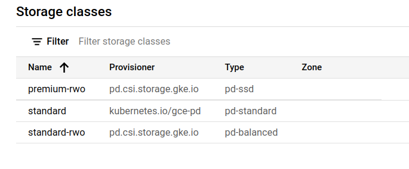
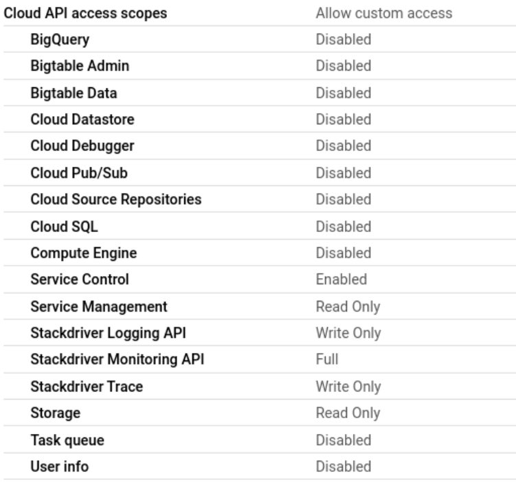

helm chart를 이용하여 GKE에 Airflow Cluster를 구성한다. 

## Bug Report
```bash
$ gcloud container clusters create airflow-cluster --machine-type n1-standard-4 --num-nodes 2 --region "asia-northeast3"
```

GKE cluster를 생성하는 중에 권한 관련해서 오류가 발생했다.

```bash
ERROR: (gcloud.container.clusters.create) ResponseError: code=400, message=Failed precondition when calling the ServiceConsumerManager: tenantmanager::185014: Consumer 706614987791 should enable service:container.googleapis.com before generating a service account.
com.google.api.tenant.error.TenantManagerException: Consumer should enable service:container.googleapis.com before generating a service account
```

현재 admin 계정으로 오류 발생한 서비스에 권한을 주었다.

```bash
$ gcloud services enable container.googleapis.com
```

다시 실행하니 cluster가 잘 생성되었다.

```bash
$ gcloud container clusters create airflow-cluster --machine-type n1-standard-4 --num-nodes 2 --region "asia-northeast3"
Default change: VPC-native is the default mode during cluster creation for versions greater than 1.21.0-gke.1500. To create advanced routes based clusters, please pass the `--no-enable-ip-alias` flag
Note: Your Pod address range (`--cluster-ipv4-cidr`) can accommodate at most 1008 node(s).
Creating cluster airflow-cluster in asia-northeast3... Cluster is being health-checked...⠏                                                                            
Creating cluster airflow-cluster in asia-northeast3... Cluster is being health-checked (master is healthy)...done.                                                    
Created [https://container.googleapis.com/v1/projects/my-project-123456/zones/asia-northeast3/clusters/airflow-cluster].
To inspect the contents of your cluster, go to: https://console.cloud.google.com/kubernetes/workload_/gcloud/asia-northeast3/airflow-cluster?project=my-project-123456
kubeconfig entry generated for airflow-cluster.
NAME             LOCATION         MASTER_VERSION   MASTER_IP     MACHINE_TYPE   NODE_VERSION     NUM_NODES  STATUS
airflow-cluster  asia-northeast3  1.21.9-gke.1002  34.64.205.88  n1-standard-4  1.21.9-gke.1002  6          RUNNING
```

airflow 네임스페이스를 생성한다.

```bash
$ kubectl create namespace airflow
```

이후 airflow helm chart를 다운받아 구성하고 설정 부분은 수정하여 업데이트한다.

```bash
$ helm repo add apache-airflow https://airflow.apache.org
$ helm upgrade --install airflow apache-airflow/airflow -n airflow --debug

$ helm show values apache-airflow/airflow > values.yaml
( value.yaml 수정 )
$ helm upgrade --install airflow apache-airflow/airflow -n airflow -f values.yaml --debug
```

> 참고 : [Deploying Airflow on Google Kubernetes Engine with Helm](https://towardsdatascience.com/deploying-airflow-on-google-kubernetes-engine-with-helm-28c3d9f7a26b)

아래 airflow helm charts를 참조하였다.

> [Helm Chart for Apache Airflow - helm-chart Documentation](https://airflow.apache.org/docs/helm-chart/stable/index.html)  
[airflow 1.5.0 · apache-airflow/apache-airflow](https://artifacthub.io/packages/helm/apache-airflow/airflow)

KubernetesExecutor로 설정되어 있어 Pod가 생성되어 각 task가 실행되었고 완료 후 pod가 종료되었다.

```console
$ kubectl get pods -n airflow
NAME                                                               READY   STATUS      RESTARTS   AGE
airflow-postgresql-0                                               1/1     Running     0          45m
airflow-scheduler-59fc65b44d-nxpzg                                 3/3     Running     0          39m
airflow-statsd-7586f9998-g4xp8                                     1/1     Running     0          45m
airflow-triggerer-8456b4c497-nhdp9                                 2/2     Running     0          39m
airflow-webserver-5997fb4b85-fm6k2                                 1/1     Running     0          39m
examplebashoperatorrunafterloop.25eab555a7ef4f4c98e23476a2816fd3   0/1     Init:0/1    0          1s
examplebashoperatorrunafterloop.e24b898b83964db7b8a4ac34ce62a504   0/1     Init:0/1    0          3s
examplebashoperatorrunme1.c835e740dd864daaa7cf0f2830230ab2         0/1     Completed   0          55s
$ kubectl get pods -n airflow
NAME                                 READY   STATUS    RESTARTS   AGE
airflow-postgresql-0                 1/1     Running   0          45m
airflow-scheduler-59fc65b44d-nxpzg   3/3     Running   0          40m
airflow-statsd-7586f9998-g4xp8       1/1     Running   0          45m
airflow-triggerer-8456b4c497-nhdp9   2/2     Running   0          40m
airflow-webserver-5997fb4b85-fm6k2   1/1     Running   0          40m
```

### Error on PersistentVolumeClaim 
AWS 기반의 EKS에 띄웠을 때는 오류가 없었는데 GCP engine에서는 PersistentVolumeClaim 관련하여 오류가 발생한다. 

```bash
$ kubectl describe pvc airflow-logs -n airflow
Name:          airflow-logs
Namespace:     airflow
StorageClass:  standard
Status:        Pending
Volume:        
Labels:        app.kubernetes.io/managed-by=Helm
               chart=airflow-1.5.0
               component=logs-pvc
               heritage=Helm
               release=airflow
               tier=airflow
Annotations:   meta.helm.sh/release-name: airflow
               meta.helm.sh/release-namespace: airflow
               volume.beta.kubernetes.io/storage-provisioner: kubernetes.io/gce-pd
Finalizers:    [kubernetes.io/pvc-protection]
Capacity:      
Access Modes:  
VolumeMode:    Filesystem
Used By:       airflow-scheduler-77cf79bb55-hcb2b
               airflow-triggerer-555bbd54f6-gmtcr
               airflow-webserver-bbf7b7976-mplmv
Events:
  Type     Reason              Age                  From                         Message
  ----     ------              ----                 ----                         -------
  Warning  ProvisioningFailed  37s (x9 over 4m18s)  persistentvolume-controller  Failed to provision volume with StorageClass "standard": invalid AccessModes [ReadWriteMany]: only AccessModes [ReadWriteOnce ReadOnlyMany] are supported
```

→ persistence : enabled = False로 설정하여 storage를 사용하지 않도록 하였다.   
확인해보니 노드의 Storage Class의 access와 관련된 문제인 것으로 확인된다.



### Error : `Cloud Storage Access denied`
airflow helm chart에서 아래와 같이 cloud storage로 remote logging을 적용하도록 한다.
```
  logging:
    remote_logging: 'True'  
    colored_console_log: 'True' 
    remote_base_log_folder: "gs://airflow-logs/" 
    remote_log_conn_id: "google_cloud_default"  
```
하지만 기존 default로 설정된 service account로는 로깅이 남지 않았다.

gcloud sdk를 통해 확인해보니 파일을 가져오려니 아래와 같이 접근이 거부되었다.
```
$ ./google-cloud-sdk/bin/gsutil cp airflow.cfg gs://airflow-logs
Copying file://airflow.cfg [Content-Type=application/octet-stream]...
AccessDeniedException: 403 Access denied
``` 

[이전 액세스 범위에서 마이그레이션 ](https://cloud.google.com/kubernetes-engine/docs/how-to/access-scopes?hl=ko#gcloud)에서 확인해보니 **Kubernetes 버전 1.10부터 gcloud 및 Cloud Console은 새로운 클러스터 및 새로운 노드 풀의 compute-rw 액세스 범위를 더 이상 기본적으로 부여하지 않습니다**라고 한다. compute-rw는 모든 cloud api에 권한을 부여할 수 있도록 하는데 기본적으로 읽기 전용으로 부여하는 것으로 보인다. 

실제로 compute 서비스 계정으로 부여된 노드의 API and identity management에서 확인하니 아래와 같이 storage에 읽기 전용으로만 설정되어 있다.



**동등한 Identity and Access Management(IAM) 역할이 있는 커스텀 서비스 계정을 만드는 것이 좋습니다.**라고 권장되어, 아래와 같이 설정하였다.
1. 서비스 계정을 새로 생성하여
2. 필요한 권한을 부여하고
3. 이를 기반으로 클러스터를 재생성하였다. 

```console
$ export NODE_SA_NAME=kubernetes-engine-node-sa
$ gcloud iam service-accounts create $NODE_SA_NAME \
  --display-name "GKE Node Service Account"
$ export NODE_SA_EMAIL=`gcloud iam service-accounts list --format='value(email)' \
  --filter='displayName:GKE Node Service Account'`
$ export PROJECT=`gcloud config get-value project`
$ gcloud projects add-iam-policy-binding $PROJECT \
  --member serviceAccount:$NODE_SA_EMAIL \
  --role=roles/editor # objects.list.get을 위해 필요함
$ gcloud projects add-iam-policy-binding $PROJECT \
  --member serviceAccount:$NODE_SA_EMAIL \
  --role=roles/storage.objectCreator
$ gcloud projects add-iam-policy-binding $PROJECT \
  --member serviceAccount:$NODE_SA_EMAIL \ 
  --role=roles/storage.objectViewer
$ gcloud container clusters create --service-account=$NODE_SA_EMAIL 
```

airflow 실행시켜 task를 돌리니 log가 기록되었다.


> 참고 : [GCP secret manager 참고](https://external-secrets.io/v0.4.4/provider-google-secrets-manager/)