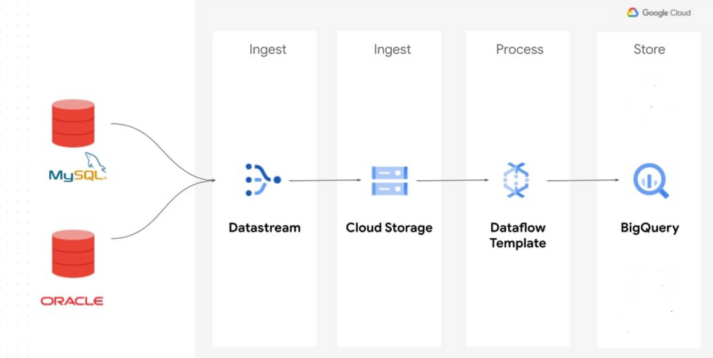

Google Cloud에서 Data Fusion과 Data Flow를 비교한 article을 참고하였다.

## Data Fusion vs. Data Flow


추가적으로 아래와 같이 차이점이 있다.

- Dataflow를 사용하는 경우 CDC를 적용하기 위해 Google (서버리스) Datastream을 추가한다.
- Data Fusion의 경우 worker를 프로비저닝을 전제로 한다. 자체 대시보드를 제공한다.

## MERGE query 비교
### Data Fusion

```sql
MERGE `datatest.{table_name}` as T
USING (SELECT A.* 
		FROM (SELECT * FROM `datatest._staging_{table_name}` WHERE _batch_id = 1649214025623 AND _sequence_num > 18) as A
		LEFT OUTER JOIN
			(SELECT * FROM `datatest._staging_{table_name}` 
			 WHERE _batch_id = 1649214025623 AND _sequence_num > 18) as B 
		ON A.`{key_column}` = B.`_before_{key_column}` AND A._sequence_num < B._sequence_num
       WHERE B.`_before_{key_column}` IS NULL) as D
ON T.`{key_column}` = D.`_before_{key_column}`
WHEN MATCHED AND D._op = "DELETE" THEN
  DELETE
WHEN MATCHED AND D._op IN ("INSERT", "UPDATE") THEN
  UPDATE SET ..., `_sequence_num` = D.`_sequence_num`, _is_deleted = null
WHEN NOT MATCHED AND D._op IN ("INSERT", "UPDATE") THEN
  INSERT {columns}
VALUES {values}
```

### DataFlow

```sql
MERGE `{project}.{database}.{table_name}` AS replica 
USING (SELECT {columns},`_metadata_timestamp`, `_metadata_read_timestamp`,`_metadata_read_method`,`_metadata_source_type`,`_metadata_deleted`,`_metadata_change_type`,`_metadata_log_file`,`_metadata_log_position` 
		FROM (SELECT {columns}, `_metadata_timestamp`,`_metadata_read_timestamp`,`_metadata_read_method`,`_metadata_source_type`,`_metadata_deleted`,`_metadata_change_type`,`_metadata_log_file`,`_metadata_log_position`, ROW_NUMBER() OVER (PARTITION BY gvkey ORDER BY _metadata_timestamp DESC, _metadata_log_file DESC, _metadata_log_position DESC, _metadata_deleted ASC) as row_num 
		FROM `innate-plexus-345505.compustat.{table_name}_log` 
		WHERE COALESCE(_PARTITIONTIME,  CURRENT_TIMESTAMP()) >= TIMESTAMP(DATE_ADD(CURRENT_DATE(), INTERVAL -2 DAY)) AND (COALESCE(_PARTITIONTIME, CURRENT_TIMESTAMP()) >= TIMESTAMP(DATE_ADD(CURRENT_DATE(), INTERVAL -1 DAY)) OR (_PARTITIONTIME >= TIMESTAMP(DATE_ADD(CURRENT_DATE(), INTERVAL -2 DAY)) AND _metadata_deleted))) 
		WHERE row_num=1) AS staging 
ON replica.{key_column} = staging.{key_column} 
WHEN MATCHED AND replica._metadata_timestamp <= staging._metadata_timestamp AND staging._metadata_deleted=True THEN 
	DELETE 
WHEN MATCHED AND replica._metadata_timestamp <= staging._metadata_timestamp THEN 
  UPDATE SET ..., `_metadata_timestamp` = staging._metadata_timestamp, `_metadata_read_timestamp` = staging._metadata_read_timestamp, `_metadata_read_method` = staging._metadata_read_method, `_metadata_source_type` = staging._metadata_source_type, `_metadata_deleted` = staging._metadata_deleted, `_metadata_change_type` = staging._metadata_change_type, `_metadata_log_file` = staging._metadata_log_file, `_metadata_log_position` = staging._metadata_log_position 
WHEN NOT MATCHED BY TARGET AND staging._metadata_deleted!=True THEN 
	INSERT ( {columns},`_metadata_timestamp`,`_metadata_read_timestamp`,`_metadata_read_method`,`_metadata_source_type`,`_metadata_deleted`,`_metadata_change_type`,`_metadata_log_file`,`_metadata_log_position`) 
VALUES (staging.{columns}, staging._metadata_timestamp, staging._metadata_read_timestamp, staging._metadata_read_method, staging._metadata_source_type, staging._metadata_deleted, staging._metadata_change_type, staging._metadata_log_file, staging._metadata_log_position)
```
### summary
- Data Fusion에서는 `_sequence_num` 칼럼을 기준으로 비교하여 데이터를 업데이트한다.
- Data Flow에서는 primary key, log 메타 데이터를 기반으로 고유 row값을 계산한 `row_num` 칼럼을 기준으로 데이터를 업데이트한다.( Data Fusion의 `_sequence_num` 과 동일한 역할을 수행하는 것으로 보임 )
- Data Flow `MERGE` 쿼리가 보다 복잡하여 시간이 좀 더 소요되는 것으로 보인다.
- Data Fusion에서 사용한 임시 테이블(`_staging`)은 MERGE 완료 후 사라지지만 Data Flow에서 사용한 임시 log테이블은 잔류한다.

## Dataflow with Datastream + BigQuery


1. MySQL에 데이터가 변경되면 Datastream에서 이를 변경 사항을 Cloud Storage에 파일로 업데이트한다.
	
2. Dataflow - Datastream to BigQuery 탬플릿을 생성하여 PubSub 알람을 통해 변경 사항을 BigQuery에 반영한다.
3. BigQuery에 로그 테이블(`{table_name}_log`)에 데이터 변경 사항이 replicate되고 이후 원본 테이블과 MERGE한다.
	