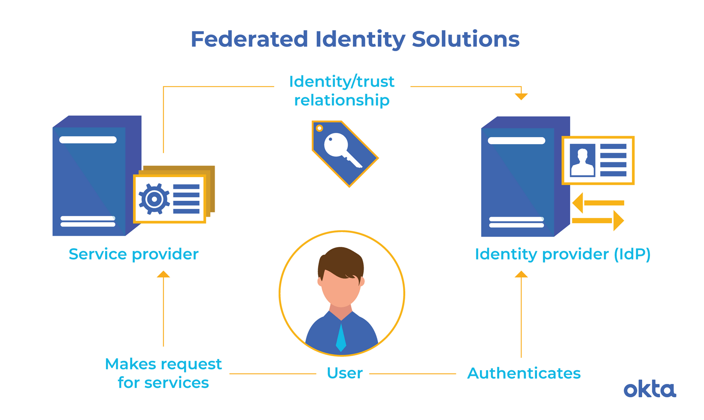

## Concepts
How to start using AWS Cognito  - Authorize, Authenticate and Federate user in [2021] 을 참고하여, 개념적으로 설명하면 authentication(인증)과 authorization(인가)을 포함한다. authentication은 identity, access에 대한 관리를 의미하며, **사용자가 누구인지**를 검증한다. 주로 Username, Password를 사용하거나 SSO를 통해 로그인하는 경우를 포함한다. authorization은 리소스에 접근하기 위한 **permission**을 제공하는 것을 의미한다. 

federation은 united, trusted relation을 의미한다.

> 페더레이션 아이덴티티란 무엇인가요? | Okta Identity Korea 

- identity federation : identity provider, service provider간에 사용자를 인증하고, authorization을 위한 정보를 전달하는 trust 시스템을 의미한다.  
- identity provider : 사용자 로그인 정보를 저장하고 관리한다.
- service provider : identity provider에 의해 제공된 인증 및 인가 정보를 기반으로 서비스를 제공한다.
- open standards : OIDC( OpenID Connect ), SAML, OAuth 2.0와 같은 공개 표준

## AWS Cognito
AWS Cognito User Pool은 authentication을 제공한다. 자체적으로 identity provider 역할을 하거나, Social identity provider, SAML identity provider를 사용하는 인증 방식이 있다.

- [Role-based access control](https://docs.aws.amazon.com/cognito/latest/developerguide/role-based-access-control.html)
- [Attribute-based access control](https://www.chaosgears.com/post/enabling-amazon-cognito-identity-pools-and-aws-iam-to-perform-attribute-based-access-control)
- [Amazon Cognito를 이용한 OIDC 인증/인가 프로세스](https://waspro.tistory.com/669)
- [Pre Token Generator Lambda Trigger](https://docs.aws.amazon.com/ko_kr/cognito/latest/developerguide/user-pool-lambda-pre-token-generation.html)
- [How to start using AWS Cognito: Authorize, Authenticate and Federate user in [2021]](https://www.archerimagine.com/articles/aws/aws-cognito-tutorials.html)
- [How Amazon Cognito works with IAM](https://docs.aws.amazon.com/cognito/latest/developerguide/security_iam_service-with-iam.html)

## KeyCloak
국제적인 인증, 인가 표(SAML, OAuth 2.0 등)을 모두 제공하는 오픈소스로 Kubernetes, MSA 환경에 최적화된 솔루션이다.
- SSO
- ID 중개 및 소셜 로그인
- 관리자/계정관리 콘솔
- 표준 프로토콜( OpenID Connect + OAuth 2.0, SAML ) 지원
- 기본적으로 Java 기반의 H2 DB를 제공한다. 
- 세분화된 권한 부여 정책 및 다양한 액세스 제어 매커니즘으로 리소스 보호
	- Attribute-Based-Access-Contorl
	- Role-Based-Access-Control
	- User-Based-Access-Control
	- Context-Based-Access-Control
	- Rule-Based-Access-Control
	- Time-Based-Access-Control
- 중앙 집중형 정책 결정 
- REST 기반
- 권한 부여 워크플로 및 사용자 관리 액세스

리소스는 keycloak 관리 콘솔이나 protection API를 통해 관리 가능하다. 

### 인증 서비스
권한 부여 서비스는 RESTfull 엔드포인트로 구성된다.
- 토큰 엔드포인트 : 서버에서 액세스 토큰을 얻어 리소스에 액세스할 수 있다. 
- 리소스 관리 엔드포인트
- 권한 관리 엔드포인트 

### OpenID Connect(OIDC) vs. OAuth 2.0
keycloak은 인증 방식이 OAuth 2.0을 기반으로 한 OIDC이다.
- OIDC : Oauth 2.0의 확장 인증 프로토콜로, 인증에 초점을 맞춘다.
- OAuth 2.0 : 데이터에 대한 액세스 권한 부여에 초점을 맞춘다.

### Google Cloud SSO
SAML 제휴를 통해 KeyCloak과 Cloud ID/Google workspace 계정 간에 SSO를 설정할 수 있다.

다음과 같이 KeyCloak 서버를 구성한다.
- Client ID : `google.com`
	- Name : `Google Cloud`
	- Sign Assertions : 사용
    ..
- Client Protocol : SAML
- Client SAML endpoint : -

## architecture
keycloak은 모든 메타 데이터, 구성을 관리할 수 있는 네임스페이스와 같다.   

### 프로세스

> 출처  
https://alice-secreta.tistory.com/28  
https://www.keycloak.org/docs/latest/authorization_services/#_overview_architecture  
https://www.comakeit.com/blog/quick-guide-using-keycloak-identity-access-management/  
https://developers.redhat.com/blog/2019/12/11/keycloak-core-concepts-of-open-source-identity-and-access-management#wrapping_up
